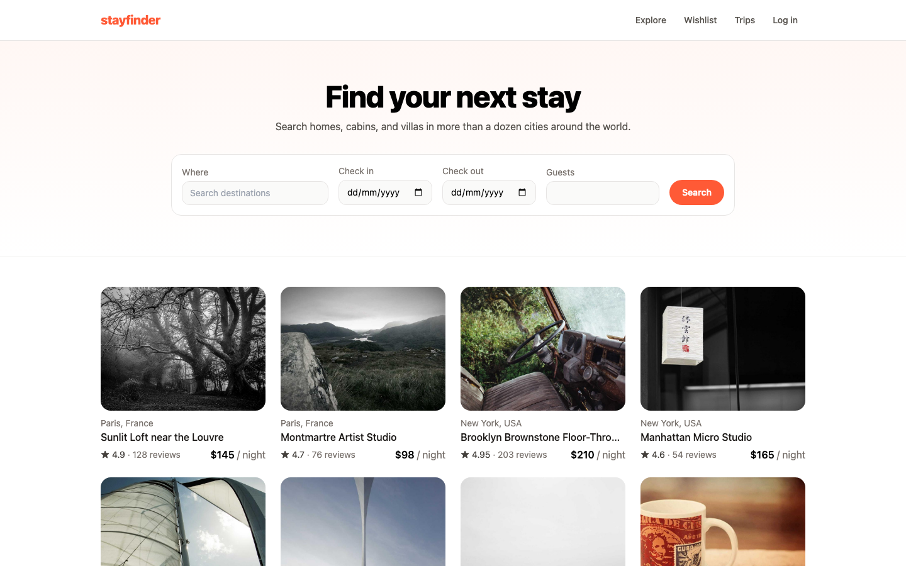
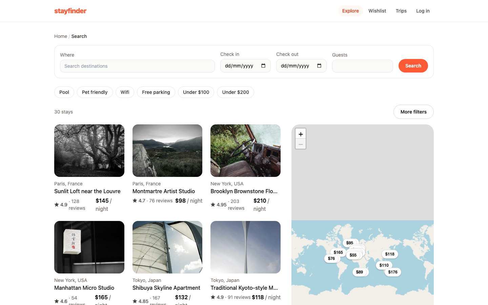
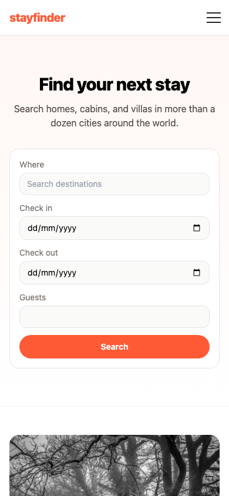

# Stayfinder

A responsive, Airbnb-style stay-booking app built with React — a portfolio project demonstrating
real-world frontend engineering (routing, async data, auth, forms, state, testing) end-to-end,
without a real backend.

**[Live demo](#)** — replace with your deployed Netlify URL.



| Search results with interactive map | Listing detail with breadcrumbs | Responsive on mobile |
|---|---|---|
|  |  |  |

## Overview

Stayfinder is a from-scratch clone of Airbnb's core booking experience: search and filter listings,
browse a listing's gallery/amenities/reviews/location, book a date range with live price calculation,
save favorites, and view past trips — all backed by a mock API that behaves exactly like a real one
(network latency, loading states, error responses) but ships as a single static site with zero server
to run or pay for. I built it to go deep on the parts of frontend engineering that don't show up in a
tutorial: race conditions in async state, timezone bugs, accessibility details, and the kind of test
coverage gaps that only show up once real users touch the app.

## Features

- Search and filter listings by location, dates, guest count, price range, property type, and amenities,
  plus quick-filter chips and a live result count
- An interactive map on the search results page (custom price-pin markers, synced with the listing you're
  hovering) and on each listing's detail page
- Listing detail pages with an image gallery, host info, reviews, and breadcrumb navigation
- Mock authentication (sign up / log in) and a wishlist, both persisted per browser
- A full booking flow: date-range selection with availability blocking, live price breakdown, and a
  trips history page
- Toast confirmations, a floating "back to top" control, scroll reset on navigation, a custom 404 page,
  and a top-level error boundary so a component crash never shows a blank white screen

## Tech stack

| Concern | Choice | Why |
|---|---|---|
| Build tool | Vite | Fast dev server, minimal config |
| UI library | React 19 | Concurrent-safe hooks, current ecosystem |
| Routing | React Router v7 | Standard SPA routing, URL-driven search state |
| Styling | Tailwind CSS v3 | Fast, consistent, responsive-first |
| Mock API | MSW (Mock Service Worker) | Intercepts real `fetch` calls in-browser — real async/loading/error code paths with no server to deploy |
| Map | Leaflet + react-leaflet (OpenStreetMap tiles) | Free, no API key, production-quality |
| Date picker | react-day-picker + date-fns | Lightweight, accessible range picker; timezone-safe date formatting |
| State | React Context + custom hooks | The app is small enough that Redux/Zustand would be over-engineering |
| Persistence | localStorage | Survives a refresh for the wishlist and mock session, scoped per visitor |
| Testing | Vitest + React Testing Library | Fast, Vite-native, tests real user interactions over implementation details |
| Deployment | Netlify | Static hosting; `netlify.toml` handles SPA routing |

## Why a mocked backend?

There's no server here on purpose. [MSW](https://mswjs.io/) intercepts network requests in the browser —
including in the production build — so the app calls real `fetch()`, hits real loading/error states, and
behaves exactly like it's talking to a REST API, while deploying as a single static site. Data (users,
wishlist, bookings) persists in `localStorage`, scoped per visitor.

## Architecture

Feature-folder layout: each folder under `src/features/` (listings, search, auth, wishlist, booking,
reviews, map, toast) owns its own components, hooks, and API calls. `src/components/ui/` holds only
generic, feature-agnostic primitives (Button, Modal, Skeleton, Breadcrumbs, ...). `src/mocks/` is the
entire "backend" — seed data, MSW request handlers, and a localStorage-backed mock database. Pages under
`src/pages/` stay thin, composing features rather than owning logic.

## Challenges and how I solved them

The features were the easy part. Most of what I actually learned building this came from bugs that only
show up once you stop treating async state as instantaneous.

**A timezone bug that silently shifted every booking date.** The booking flow originally built ISO date
strings with `date.toISOString().slice(0, 10)`, which converts to UTC first — so a date picked at local
midnight in the calendar would shift by a day for any timezone east of UTC. The disabled/booked-dates
display had the *opposite* bug, because it re-parsed those date-only strings with `new Date(...)`, which
JavaScript resolves as UTC midnight. Two bugs that looked unrelated turned out to be the same root cause
in both directions. I fixed both call sites to use `date-fns`'s `format`/`parseISO` for timezone-safe
local-date handling, and verified it under `TZ=Asia/Tokyo` and `TZ=Pacific/Kiritimati` (UTC+14, about as
far from UTC as you can get) to be sure.

**Async races in the wishlist.** Toggling the wishlist optimistically updates the UI before the network
call resolves — good for perceived speed, but it opened two separate bugs. First, logging out (or
switching users) while a wishlist `GET` was still in flight let that stale response repopulate the list
after logout. I fixed it with the same `cancelled`-closure idiom I'd already used in a couple of other
data-fetching hooks, so an effect's cleanup automatically invalidates its own in-flight request. Second,
a boolean "did the user just toggle something" latch meant one wishlist toggle could permanently block
the *initial* fetch from ever applying its result — silently wiping a user's real saved listings if they
toggled before that first fetch resolved. I replaced the boolean with a version counter that only
invalidates the specific fetch that was in flight at toggle time, and added a rollback in the toggle's
catch block so a failed request doesn't leave the UI permanently diverged from the server.

**Double-booking was possible.** The UI disabled already-booked dates in the calendar, but nothing
stopped two requests from booking the same overlapping range if they both landed before either one
"knew" about the other — the classic gap between client-side validation and server-side truth. I added a
proper `[start, end)` interval overlap check to the mock booking endpoint and return a 409 with a message
the existing error UI already knew how to display, so no client changes were needed beyond the fix itself.

**A "backend" bug my test suite couldn't see.** Since Stayfinder has no real server, MSW is the entire
backend — every `fetch()` in the app assumes it always gets JSON back. But if the mock service worker
ever fails to intercept a request (a slow first load, a sandboxed preview pane, a browser extension), the
request falls through to the real dev/prod server, which returns the app's own `index.html` with a 200
status — and `res.json()` throws a raw `Unexpected token '<'` parser error straight into the UI. My test
suite never caught this because it runs MSW's Node interception layer (`setupServer`), which is a
different mechanism from the real browser Service Worker (`setupWorker`) and doesn't share its failure
modes. I only found it by watching a real preview render the raw error. The fix: a single `fetchJson()`
wrapper that every API call now goes through, which validates the response before parsing and throws a
friendly, actionable message instead of a parser error — plus a regression test that specifically
simulates MSW returning HTML instead of JSON, so this exact failure mode can't silently reappear.

**Debounced filters and history pollution.** Typing in the price filter fired a full listings refetch
(with a skeleton flash) on every keystroke, and every incremental filter change was pushing a new browser
history entry, so "Back" from a search page took a dozen presses to undo. I debounced the price inputs
(~300ms) and split search-param updates into two modes: filter tweaks replace the current history entry,
while an explicit new search from the search bar pushes a real one — so "Back" means what people expect
it to.

**Mobile details that are easy to skip.** A tap target under the ~44px guideline (the mobile nav toggle)
and a listing gallery's thumbnail row that could overflow its container on listings with a lot of photos
both slipped through an initial pass and had to come back as follow-up fixes — a reminder that
responsive design bugs often aren't visible on a 1440px monitor.

**A scaffolding detour.** The project scaffolded with Tailwind v4 by default; I hit config
incompatibilities almost immediately and downgraded to v3 rather than debug a brand-new major version
mid-project — a reminder that "latest" isn't always the right choice for a deadline.

## Testing

```bash
npm test
```

Vitest + React Testing Library, currently ~49 tests across 21 files. I'm not chasing 100% coverage —
the goal is testing discipline where it matters: pure logic (price calculation, filtering), the trickier
async/race-condition fixes above (each one shipped with a regression test that fails against the old code
and passes against the fix), and one end-to-end integration test covering search → listing → login →
booking. Date-dependent tests freeze the system clock (`vi.useFakeTimers`) instead of relying on the real
calendar, so the suite doesn't quietly start failing once the real date moves past whatever was hardcoded.

## Running locally

```bash
npm install
npm run dev
```

Log in with the seeded demo account — `demo@stayfinder.com` / `password123` — or sign up as a new user.

## What I'd do next

- A real backend (even a small one) to demonstrate full-stack range, not just the client half
- Image optimization/lazy loading now that the seed data has grown to 30 listings across a dozen cities
- Pagination or infinite scroll on the search grid instead of rendering every result at once
- Host-side flows (listing management) — explicitly out of scope for v1, but the natural next feature
